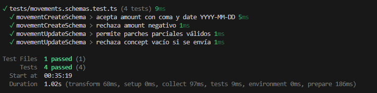
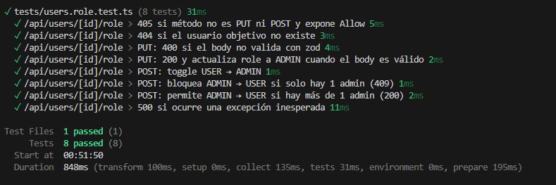
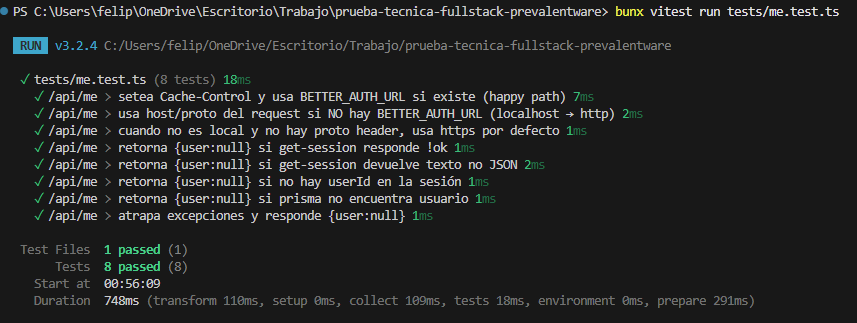
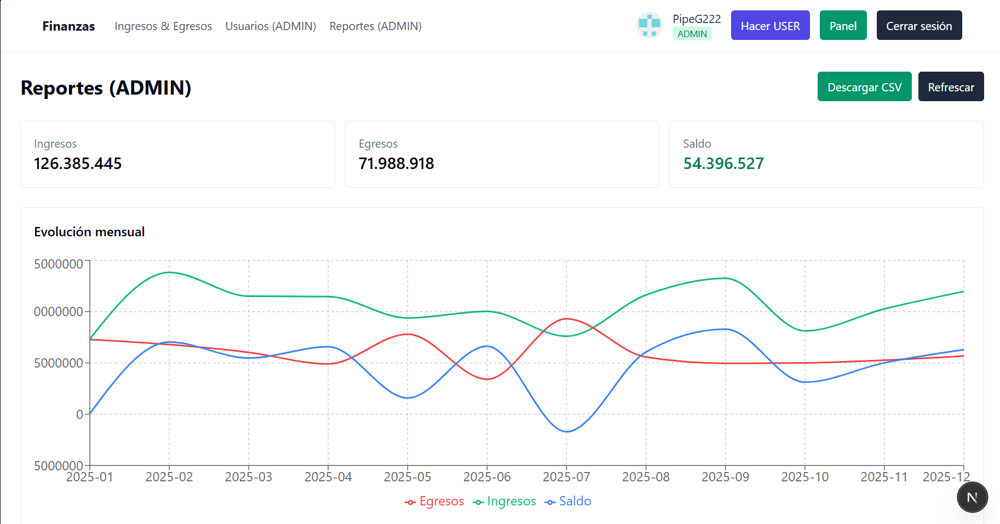
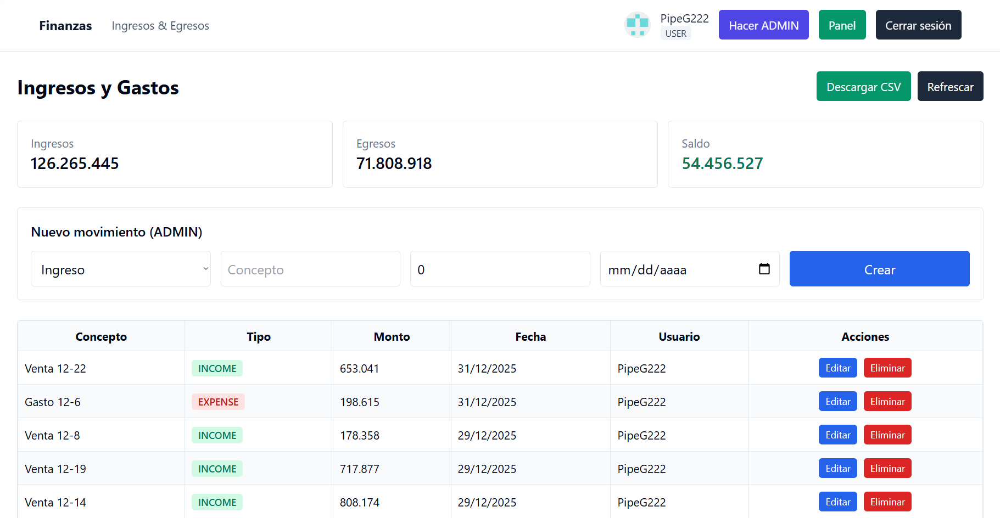
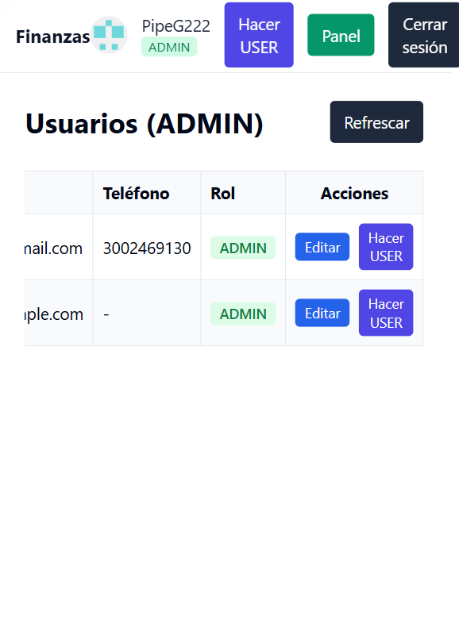

# Prueba Técnica para Desarrollador Fullstack

### Introducción

El objetivo de esta prueba técnica fue implementar un sistema de gestión de ingresos y egresos, gestión de usuarios y generación de reportes financieros.
Se trabajó con **Next.js (pages router)**, **Prisma**, **Postgres**, **Better Auth con GitHub** y **Tailwind/Shadcn** para la interfaz.

⚠️ Importante: de los **4 días disponibles** solo pude trabajar efectivamente en **2 días**, lo cual limitó el alcance. Algunas funcionalidades quedaron pendientes (paginación, filtros y búsqueda en los CRUDs).

---

### Funcionalidades Implementadas

1. **Roles y Permisos (RBAC)**

   * Usuario: accede a movimientos.
   * Administrador: accede a reportes, usuarios y movimientos.
   * Funcionalidad de **cambiar de rol** incluida para facilitar la revisión de la prueba.

2. **Gestión de Ingresos y Egresos**

   * Tabla con ingresos/egresos.
   * Creación de nuevos movimientos (solo ADMIN).

3. **Gestión de Usuarios** (solo ADMIN)

   * Listado de usuarios con rol editable.

4. **Reportes** (solo ADMIN)

   * Saldo actual.
   * Gráfico de evolución mensual (responsive y con colores diferenciados).
   * Descarga de CSV.

5. **Autenticación**

   * Login con GitHub vía Better Auth.
   * Nuevos usuarios asignados automáticamente como **ADMIN**.

6. **Seed de Base de Datos**

   * Se incluye un **seed de prueba** en Prisma para cargar datos iniciales y facilitar la revisión.

---

### Aspectos Técnicos

* **Frontend:** Next.js, TypeScript, Tailwind, Shadcn.
* **Backend:** Next.js API routes con Prisma.
* **DB:** PostgreSQL (Supabase, puerto 6543 con pooling).
* **Auth:** Better Auth + GitHub.
* **Pruebas unitarias:** con **Vitest**, se agregaron **3 pruebas** principales:

  * Validación de schemas de movimientos.
  * Endpoint de cambio de rol de usuario.
  * Endpoint `/api/me` (datos del usuario autenticado).

---

### Pendientes

* [ ] Paginación en listados.
* [ ] Filtros avanzados en los movimientos.
* [ ] Búsqueda en usuarios y movimientos.

---

### Cómo ejecutar el proyecto

1. Clonar el repo.

   ```bash
   git clone <repo_url>
   cd <repo_name>
   ```

2. Instalar dependencias.

   ```bash
   bun install
   ```

3. Ejecutar migraciones de Prisma.

   ```bash
   bunx prisma migrate dev
   ```

4. Ejecutar el seed de prueba.

   ```bash
   bunx tsx prisma/seed.ts
   ```

5. Levantar el servidor en local.

   ```bash
   bun dev
   ```

6. Correr las pruebas unitarias.

   ```bash
   bun test
   ```

---

### `.env`

En el proyecto se incluye un archivo **`.env.example`**.
El archivo **`.env` real** fue compartido por correo como solicitó la prueba.

Ejemplo de variables:

```env
DATABASE_URL="postgresql://<user>:<pass>@<host>:6543/<db>?sslmode=require&pgbouncer=true&connection_limit=1"
BETTER_AUTH_URL=http://localhost:3000
NEXT_PUBLIC_BETTER_AUTH_URL=http://localhost:3000

GITHUB_CLIENT_ID=<client_id>
GITHUB_CLIENT_SECRET=<client_secret>
```

---

### Evidencias

#### Pruebas unitarias





#### Funcionalidades






- **Notas**:
  -  Contiene diseño responsivo.
  - Se utilizo el codigo pre-cargado pero se actualizaron algunas funcionalidades..
  - El candidato debe compartir el acceso al repositorio de GitHub y el .env a los correos mlopera@prevalentware.com, jdsanchez@prevalentware.com y dfsorza@prevalentware.com
